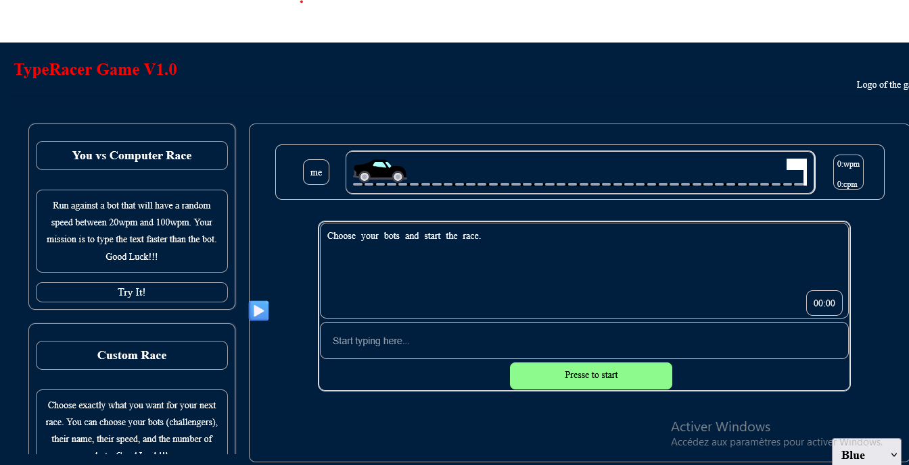

# 🚀 TypeRaceGame 🖋️

**TypeRaceGame** is a fun and engaging typing game where players race against the clock to type text as quickly and accurately as possible. 🏎️⌨️

## 🎯 Objective

Type the displayed text as fast as you can to achieve the highest score in words per minute (WPM) and characters per minute (CPM). Be careful with errors, as they affect your accuracy!

---

## 🖼️ Preview

Here's a preview of the game:

---

## ⚙️ Features

- 🖊️ **Interactive Typing Test**: Type the given text within a time limit.
- ⏱️ **Real-time Tracking**: Display live statistics such as CPM, WPM, and elapsed time.
- 🧠 **Performance Analysis**: Review your best score and accuracy rate.
- 🌗 **Simple and Intuitive Interface**: Minimalistic design to help you stay focused on typing.

---

## 🛠️ Technologies Used

- ⚛️ **JavaScript**
- 🎨 **HTML5 & CSS3**

---

## 🎮 How to Play

1. Launch the game.
2. Type the text displayed in the designated field.
3. Press **Start** when you’re done.
4. Check your statistics: **WPM**, **CPM**, **elapsed time**, **accuracy**, and **errors**.

### 🏆 Goal: **Beat your own record!**

---

💡 **Have fun and improve your typing speed! 🏎️💥**

